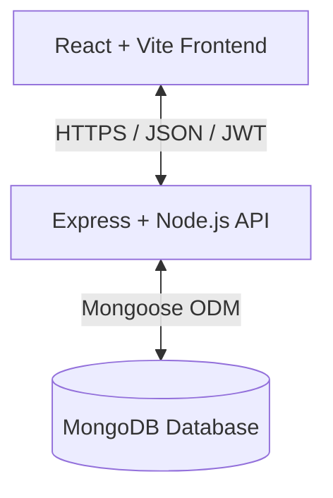

# ApexScout System Architecture

This document outlines the technical architecture and data flow of the ApexScout platform.

## 🏗️ High-Level Architecture

The system follows a classic **Three-Tier Architecture**:

## 🧩 Module Breakdown

### 1. Authentication Layer
- Uses **JWT (JSON Web Tokens)** for stateless authentication.
- Middleware-based role guards ensure that Athletes cannot access Scout analytics and vice-versa.
- Passwords are encrypted using **Bcrypt**.

### 2. Marketplace & Discovery
- Implements a complex filtering engine on the backend.
- Supports pagination and multi-field search (Name, Sport, Metrics).
- **Comparison Engine**: A specialized service that aggregates data from multiple profiles for side-by-side visualization.

### 3. Pipeline Management (Watchlist)
- Uses a Kanban data structure.
- **ScoutAthleteMeta**: A relational document that stores scout-specific notes, ratings, and statuses for each athlete without modifying the athlete's actual profile.

### 4. Data Visualization
- **Normalizer Service**: Converts varying raw athletic metrics into a uniform 0-100 scale for visual consistency.
- **Recharts Integration**: Renders Radar charts and Analytics bars based on real-time API data.

## 🔄 Data Flow Example: Athlete Metric Update
1. Athlete submits the performance form in the frontend.
2. `profileService.js` sends a PUT request to `/api/v1/profile`.
3. Backend `athleteProfileController` validates the input using Joi.
4. Metric Normalizer recalculates the 0-100 scores.
5. MongoDB document is updated.
6. Frontend receives the updated profile and triggers a re-render of the Radar Chart.

## 🛡️ Security Implementation
- **Rate Limiting**: Prevents brute-force attacks on auth endpoints.
- **Helmet**: Secures HTTP headers.
- **Mongo-Sanitize**: Prevents NoSQL injection.
- **XSS-Clean**: Sanitizes user input to prevent cross-site scripting.
